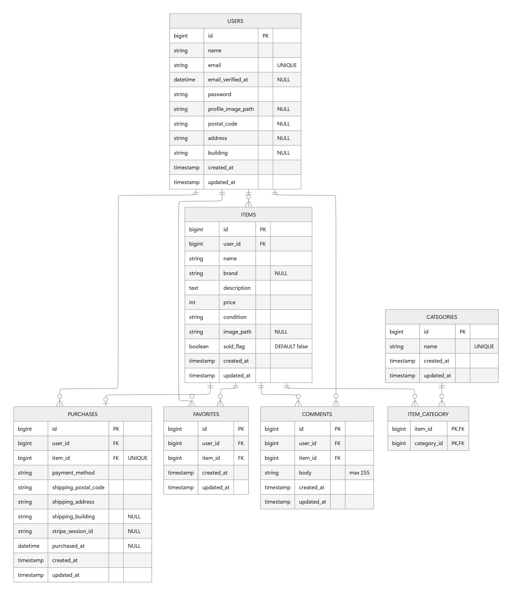

# フリマーケットアプリ

## 環境構築

### Docker ビルド

- git clone git@github.com:Yuuna-hh/fleamarket_app.git
- cd src
- docker-compose up -d --build

### Laravel セットアップ

- docker-compose exec php bash

- composer install  
  依存パッケージインストール

- cp .env.example .env  
  .env ファイル作成と以下のように編集

* DB_HOST=mysql
* DB_DATABASE=laravel_db
* DB_USERNAME=laravel_user
* DB_PASSWORD=laravel_pass

- php artisan key:generate  
  アプリケーションキー生成

- php artisan migrate
- php artisan db:seed  
  マイグレーションと初期データ投入

- php artisan storage:link  
  プロフィール画像を表示するため実行
  ※既にリンクが存在する場合はエラーが表示されますが、問題ありません

#### Stripe 設定
  Stripe決済機能を利用するため、事前にStripeアカウントを作成してください。  
  https://dashboard.stripe.com/login  
  テストモードを有効にする→「開発者」→「APIキー」を開く→「シークレットキー」をコピー
  
  .env ファイルに以下を追加
* STRIPE_SECRET=your_stripe_secret_key  
  ※Stripeダッシュボードから取得したテスト用シークレットキーを記入、本番用キーは使用しない

### トラブルシューティング

#### storage/logs の Permission denied が出る場合

エラー例：  
The stream or file "/var/www/storage/logs/laravel.log" could not be opened in append mode: Failed to open stream: Permission denied

対処：

- docker-compose exec php bash
- chmod -R 777 storage bootstrap/cache

#### SQLSTATE[HY000] [2002] Connection refused が出る場合

エラー例：  
SQLSTATE[HY000] [2002] Connection refused

対処：.env を下記の内容にしているか確認

- DB_CONNECTION=mysql
- DB_HOST=mysql
- DB_PORT=3306
- DB_DATABASE=laravel_db
- DB_USERNAME=laravel_user
- DB_PASSWORD=laravel_pass

改善しない場合：

- docker-compose restart php

#### キャッシュのクリア（必要に応じて）

- docker-compose exec php bash
- php artisan config:clear
- php artisan cache:clear
- php artisan config:cache

## URL 一覧（開発環境）

- 商品一覧画面（トップ画面）：http://localhost/
- 会員登録画面：http://localhost/register
- ログイン画面：http://localhost/login
- 商品詳細画面：http://localhost/item/{item_id}
- 商品購入画面：http://localhost/purchase/{item_id}
- 住所変更ページ：http://localhost/purchase/address/{item_id}
- 商品出品画面：http://localhost/sell
- プロフィール画面：http://localhost/mypage
- プロフィール編集画面：http://localhost/mypage/profile
- phpMyAdmin：http://localhost:8080

補足（表示切り替え機能）
- 商品一覧画面（マイリスト表示）：http://localhost/?tab=mylist
- プロフィール画面（購入した商品表示）：http://localhost/mypage?page=buy
- プロフィール画面（出品した商品表示）：http://localhost/mypage?page=sell

## テスト設計

 主要機能について合計16ファイル、40項目の Feature テストを実装しています。
- docker-compose exec php bash
- php artisan test

テスト内容
* 会員登録機能 (RegisterTest.php)
* ログイン機能 (LoginTest.php)
* ログアウト機能 (LogoutTest.php)
* 商品一覧取得 (ItemListTest.php)
* マイリスト一覧取得 (MyListTest.php)
* 商品検索機能 (ItemSearchTest.php)
* 商品詳細情報取得 (ItemDetailTest.php)
* いいね機能 (LikeTest.php)
* コメント送信機能 (CommentTest.php)
* 商品購入機能 (PurchaseTest.php)  
  Stripe決済は外部API通信が発生するため、testing環境ではStripe処理をスキップし、直接購入レコードを作成する分岐を実装しています。
* 支払い方法選択機能 (PaymentMethodTest.php)
* 配送先変更機能 (AddressChangeTest.php)
* ユーザー情報取得 (UserProfileTest.php)
* ユーザー情報変更 (UserProfileUpdateTest.php)
* 出品商品情報登録 (SellItemTest.php)
* メール認証機能 (EmailVerificationTest.php)

### テスト実行後の注意

本アプリケーションのテストでは RefreshDatabase を使用しているため、テスト実行後はデータベースが初期化されます。
テスト後に動作確認を行う場合は、以下を実行してください。
- docker-compose exec php bash
- php artisan migrate:fresh --seed

## 使用技術（実行環境）

- PHP 8.1.34
- Laravel 10.50.0
- MySQL 8.0.26
- nginx 1.21.1
- Mailhog

## コーディング規約

本アプリケーションは COACHTECH が定める以下のPHPコーディング規約およびルールに基づいて開発しています。

- https://estra-inc.notion.site/1263a94a2aab4e3ab81bad77db1cf186

## レスポンシブ対応

本アプリケーションは要件に従い、PC・タブレット幅を対象として実装しています。

## ER 図

